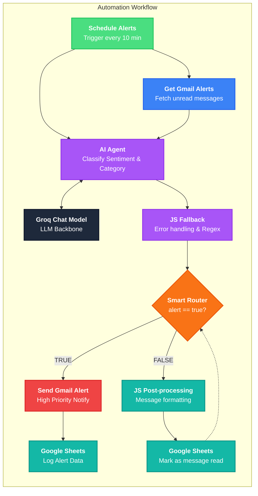

# AI Competitive Monitoring Dashboard

A premium, AI-powered dashboard for monitoring competitor activity in real-time. This project visualizes insights extracted from Google Alerts using an automated n8n workflow and LLM-based analysis.

## 🏗️ System Architecture

The monitoring system follows a modular automation pipeline that integrates Google Services, AI models, and custom logic to process competitive intelligence.

### 🧩 Workflow Breakdown
1.  **Trigger**: A scheduled cron job initiates the workflow every 10 minutes.
2.  **Ingestion**: Unread Google Alerts are fetched from Gmail via API.
3.  **Intelligence**: An AI Agent uses the **Groq Chat Model** (LLM) to perform sentiment analysis and extract key categories.
4.  **Routing**: A smart routing layer evaluates if the alert warrants immediate notification (e.g., high priority or critical competitor move).
5.  **Actions**: 
    - **High Priority**: Immediate Gmail notification and logging to Google Sheets.
    - **Low Priority**: Processed and marked as read in the system logs.

## ✨ Features
- **Real-time Analytics**: Sentiment trends and market share visualizations.
- **Smart Alert Feed**: Automated categorization and priority ranking of competitor moves.
- **Risk Assessment**: Dedicated view for flagging controversies and negative sentiment.
- **Export to PDF**: Generate high-quality PDF reports of any dashboard view.
- **Premium UI**: Dark-mode aesthetic with glassmorphism and smooth animations.

## 🛠️ Technology Stack
- **Frontend**: React + Vite
- **Styling**: Vanilla CSS (HSL Tokens + Glassmorphism)
- **Charts**: Recharts
- **Icons**: Lucide-React
- **Animations**: Framer Motion
- **Export**: html2canvas + jsPDF

## 🚀 Getting Started
1. Clone the repository
2. Install dependencies: `npm install`
3. Run the development server: `npm run dev`
